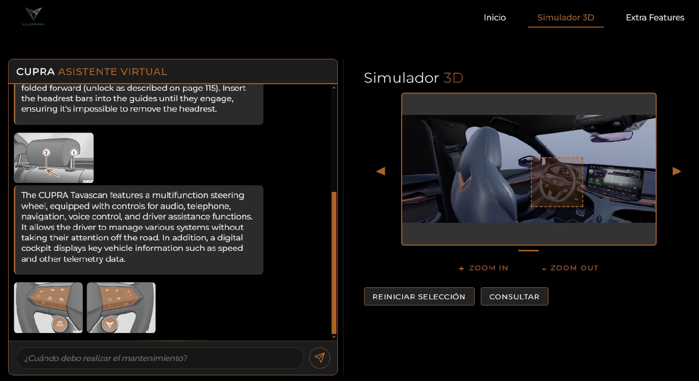
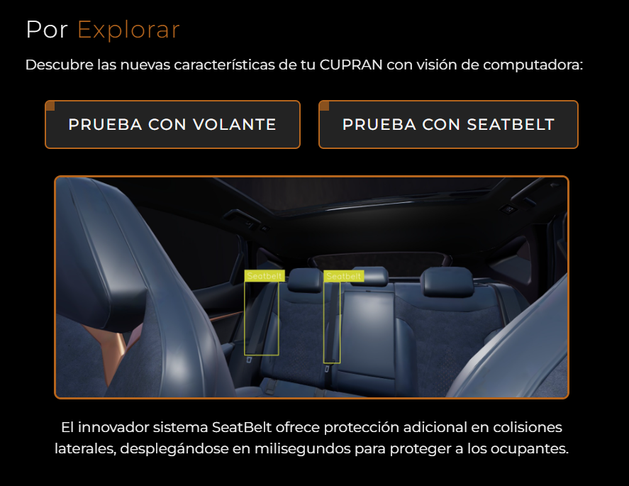

# 🏎️ Cupra Tavascan Experience Platform
**An intelligent and immersive web platform to explore the Cupra Tavascan.** Developed as part of the SEAT challenge, this project pushes the boundaries of conversational AI and image understanding.

## 🧠 Project Overview
This platform offers potential buyers a smarter, more interactive way to explore the Cupra Tavascan. By combining AI-powered conversation, image recognition, and immersive 3D visualization, users can learn about the vehicle in a dynamic and intuitive manner.



## ✨ Key Features
* **Conversational Chatbot** Ask questions and receive real-time answers and relevant images and pages from the Cupra Tavascan manual.
* **3D Interior Simulation** Explore the inside of the Tavascan in an interactive 3D environment.
* **Image Recognition** Upload photos of the car or its components to receive detailed explanations.
* **Object Detection** Automatically detects and labels parts of the car in images.
* **Brand-Aligned UI** A sleek, modern interface inspired by Cupra's visual identity, clean, intuitive, and responsive.


## ⚙️ How It Works
1. 🧹 **Data Preprocessing**
   * The Cupra Tavascan user manual (PDF) is parsed and segmented into pages and sections to generate chunks.
   * Text and images are extracted and enriched with metadata like section titles and page numbers.
   * These elements are indexed for fast and context-aware retrieval.

2. 🔍 **Retrieval-Augmented Generation (RAG)**
   * Text and image embeddings from the manual are stored in a vector database powered by Gemini.
   * For text queries:
      * A query expansion step enriches the user's question.
      * The system retrieves relevant pages using semantic search.
      * From these pages, individual chunks are re-ranked by relevance.
      * The most relevant chunks are selected, and nearby images are included to provide a richer explanation.
   * For image queries:
      * The selected image region is first converted into a descriptive text using Gemini.
      * Semantic retrieval is performed to gather relevant pages.
      * From these, image similarity is used to identify the most visually similar content.
      * A final re-ranking step selects the most informative content from those results. In both cases, a language model generates accurate and grounded answers based on the selected context.

3. 🖥️ **User Interface**
   * **Chatbot Interface** for asking questions conversationally.
   * **Image Upload & Region Selection** using the Canvas API
   * **3D Viewer** for exploring the interior of the vehicle.
   * The frontend maintains visual coherence with Cupra's brand style.
     
4. 🧠 **Computer Vision**

We used Roboflow to streamline the creation of a small image dataset and to handle the annotation process efficiently. Leveraging a YOLO-based model provided by the platform, we performed fine-tuning to tailor the detector specifically to our vehicle. This re-trained model delivered more accurate and context-aware results compared to an off-the-shelf version, improving detection performance for our use case.



## 🤖 Models
* **LLM**: Gemini-2.0 Flash - Used for query expansion, retrieval, and image description
* **Embeddings**: all-MiniLM-L6-v2 - Used for generating text embeddings for the vector database

## 🧹 Tech Stack
* **Frontend**: HTML/CSS, JavaScript, Canvas API
* **Backend**: Python (Flask), Gemini API (LLM), image processing utilities
* **Database**: Vector database (Chromadb) for semantic search
* **PDF Parsing**: PyMuPDF, custom metadata extractor

## 🧪 Try It Out
To run the project locally:
1. Navigate to the `final/` folder.
2. Run the backend server with:

```
python app.py
```

3. Open the `index.html` file in your browser to interact with the platform.
Make sure all dependencies are installed and the [manual PDF](manual.pdf) is preprocessed before launching the app.

## 🤝 Team & Acknowledgments
🏆 **Award-Winning Project** 🏆 We proudly received the **Second Prize from Cupra** at **HackUPC 2025**, recognizing our innovation, technical execution, and user experience.

Built by a passionate team for the SEAT Challenge, this project reflects our dedication to merging AI, design, and interactivity.

Special thanks to SEAT & Cupra for the inspiration, and to the hackathon mentors who supported us along the way.
